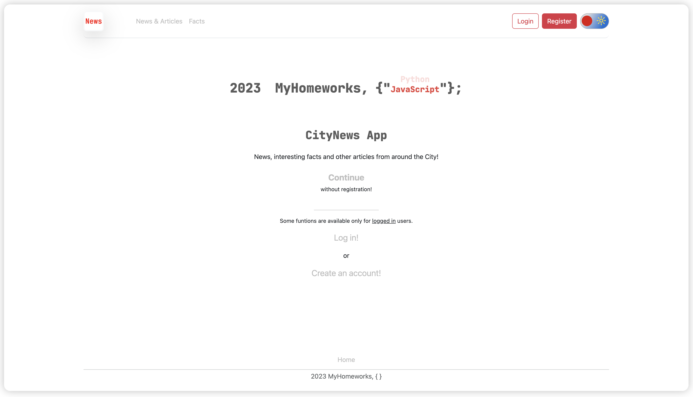

## Description
This is a Django test project using MySQL, Docker and Django Rest Framework.


## Launch instructions


1. Clone repository to your local folder;
2. Copy dev.env to .env file: ```cp dev.env .env```;
3. Open and follow the instructions in the new created .env file;
4. For this step you should already have installed Docker and docker-compose on your PC:
- make sure You are in project folder: ```cd '.../project_folder' ```;
- Run docker-compose: ```docker-compose up --build```;
- Installation can take some time, it depends on your PC resources;
- After the installation is completed, the server will start automatically on 0.0.0.0:8900;
- Open app using http://0.0.0.0:8900/ in your browser;
5. The superuser **has not** been already created;
- Create superuser manually for Your own purpose: ```cd '.../project_folder' && python3 manage.py createsuperuser``` ;
- For password change use: ```cd '.../project_folder' && python3 manage.py changepassword 'your_superuser_name' ```
- You can login in the App or in the AppAdminPage under current superuser using standart credentials: ```login: 'your_superuser_name'; pass: 'your_superuser_password' ```;
- Feel free to create ther Users directly on the App;
- Note, that You should **enter an admin panel** to **create new or edit News&Articles**;
6. Note that DataBase - MySQL;
7. To stop the server: ```Ctrl+C```;
8. To completely remove all created docker containers, images and volumes: ```docker-compose down --volumes```.

### Screenshots 

1. Main page


2. Select part


3. Display data: 'Facts'


4. Display data: 'News'


5. User's favourite


6. Detailed data: 'News'. Comments (show/add)
